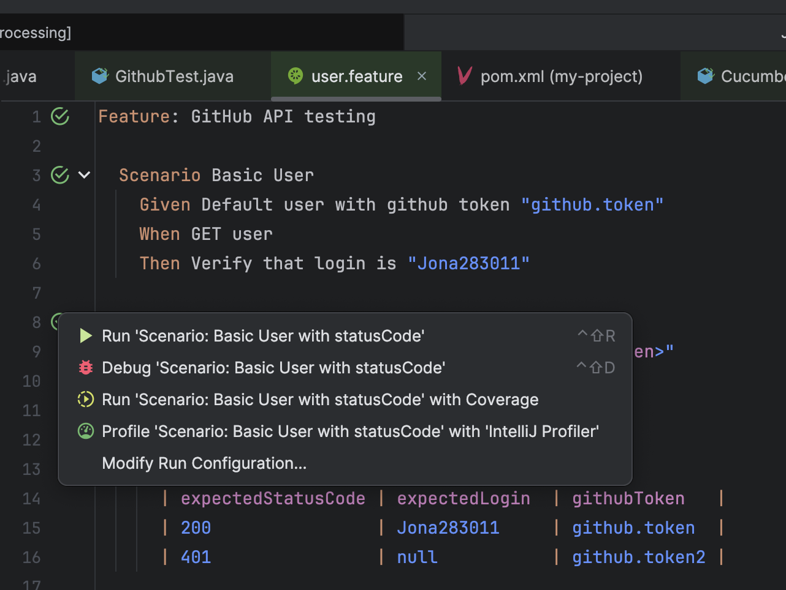

# JonaAPITest Project

This project has been created to test the Gihub API. Below are the steps to set up and run the tests.

## Requirements

- **Java**: Ensure you have Java JDK 8 or higher installed.
- **Maven**: Maven is required to manage dependencies and run tests.


## Project Structure

- **src/main/java:**: Contains the main source code of the project.
- **src/test/java:**: Contains unit tests, testRunners and steps needed for cucumber.
- **src/test/resources/features:**: Contains the project features, at the moment there is only 1.
- **pom.xml:**: Maven configuration file that manages dependencies and the project lifecycle.
- **config.properties:**:Configuration file for storing sensitive information (e.g., access tokens).


## Install dependencies
This command will download the necessary dependencies and compile the project.:
```bash
mvn clean install
```
## Run Unit tests
This command will run all the tests defined in the src/test/java directory.:
```bash
mvn test
```

## Run E2E tests
This command will run all the e2e tests defined in the testNG.xml file.:
```bash
mvn test -PE2E
```

## Run cluecumber report
Once you have executed the e2e, run this command to generate the e2e report:
```bash
mvn cluecumber:reporting
open target/generated-report/index.html
```

## Run E2E feature
Using our IDE (in my case intelliJ), if we install the cucumber and gherkin plugins we can run directly.:


## Run E2E scenario
Using our IDE (in my case intelliJ), if we install the cucumber and gherkin plugins we can run directly.:




## CI/CD
I have created a small CI/CD with a build job and 2 e2e jobs (to prepare it and run in parallel if necessary). In the job called E2E I have uploaded the cluecumber artifact so that we can have a report of the E2E in the pipeline.


### Notes
- **config.properties**: Added github token in config.properties to avoid uploading the token to the repository. Always handle sensitive information carefully and follow best practices for security.
- **AssertUtils**: The AssertUtils class has been created to cover the use case where a field is required and can be null. It has not been extended from AssertTrue because it is a static method.
- **Siganture is masked**: I have decided to mask the signature because it is a sensitive field.
- **Extra features**: I would like to cache maven dependencies.


